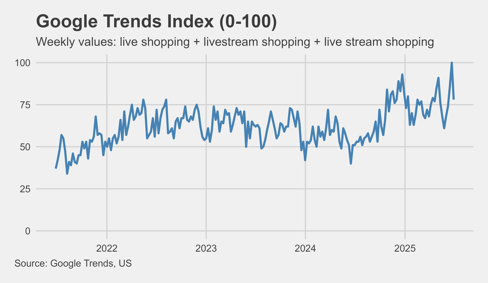

Live Shopping Search Index

# Live Shopping Search Index

## Overview
This project measures and analyzes online search interest in **live shopping** and **live selling**, using curated search term sets and data from multiple sources. The goal is to track category health, identify trends, and provide independent reference points for market analysis.

---

## Methodology

### 1. Search Term Curation
- **Initial universe:**
  - Began with ~300 hand-picked seed keywords related to live shopping.
  - Expanded recursively using Google's related search suggestions.
- **Scale:**
  - Generated over **98,000** candidate search terms.
  - Removed duplicates and irrelevant entries, resulting in ~8,000 unique terms.
- **Final index:**
  - Selected **188** expressions for the "live shopping" index.  
  - Built a parallel "live selling" index using the same approach.

### 2. Term Selection Criteria
- All selected expressions contain **intent-specific keywords** such as:
  - `"live shopping"`, `"live commerce"`, `"livestream shopping"`.
- Captures targeted queries like `"tiktok live shopping"`  
  while excluding broad terms such as `"tiktok"` or `"tiktok shop"`.
- During QA, a small number of terms were excluded due to suspected **artificial inflation** in search volume (possible bot activity).

### 3. Data Sources
- **Primary:** Google Ads Keyword Planner API — provides absolute search volume data.  
- **Secondary:** Google Trends — provides relative interest, different time granularity, and serves as an independent reference.

### 4. Parallel Indices
- **Live Shopping Index** — Tracks consumer-facing search interest.  
- **Live Selling Index** — Tracks seller-oriented interest.

---

## Key Findings

- **Facebook & Instagram Decline**  
  - Launched live shopping early in the pandemic.  
  - Interest dropped after feature removals in 2022–2023.
- **TikTok Shop Launch**  
  - Introduced in September 2023.  
  - Search interest stabilized afterward.
- **US TikTok Ban Discussions (Jan 2025)**  
  - Significant spike in search interest.  
  - Interest remained relatively high afterward.
- **Recovery Trend**  
  - Since late 2024, both "live shopping" and "live selling" indices show consistent signs of growth.  
  - Google Trends data confirms this recovery.

