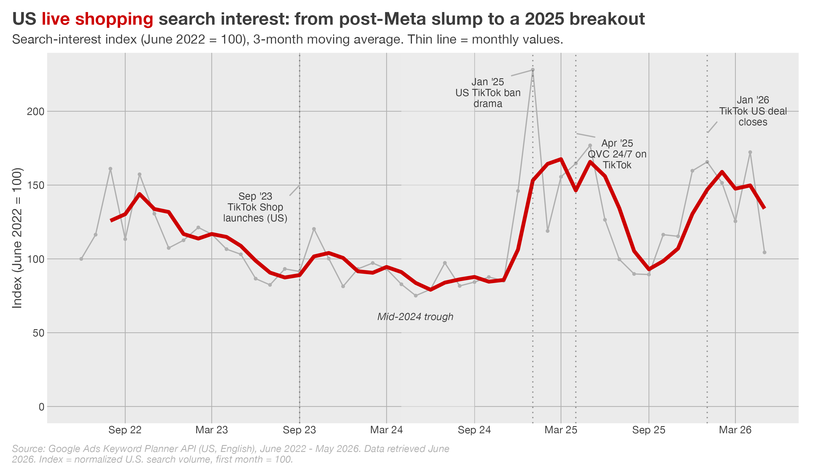
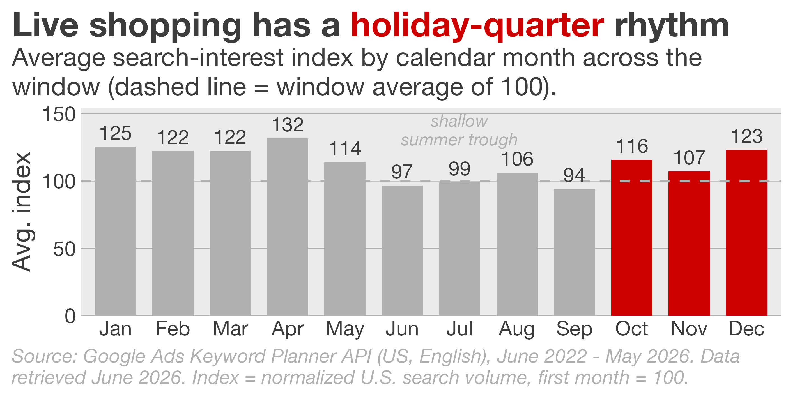
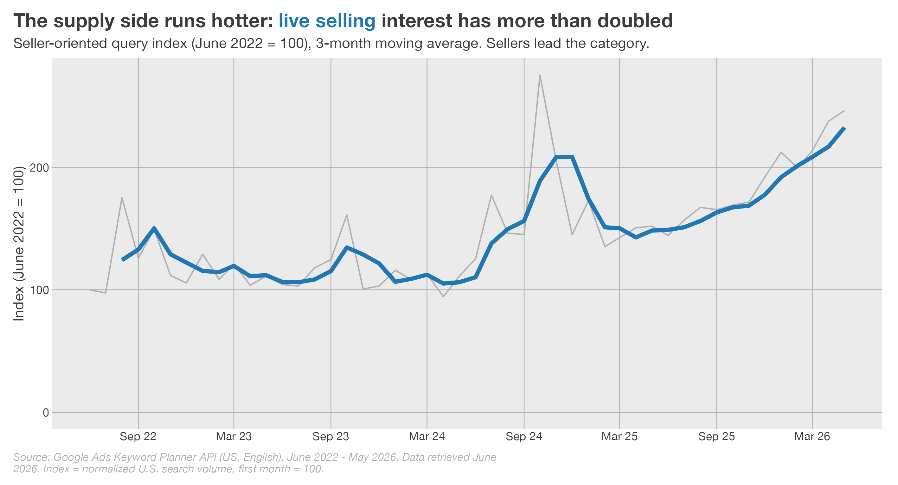
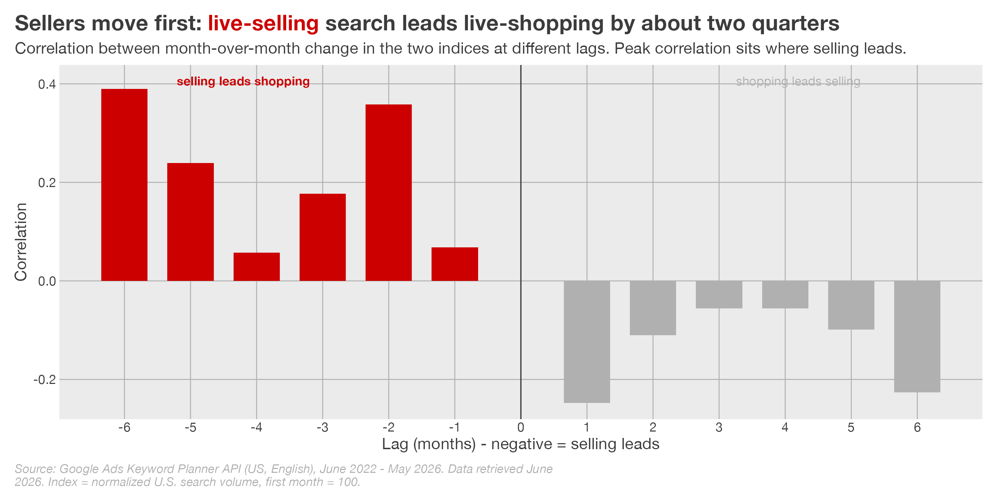
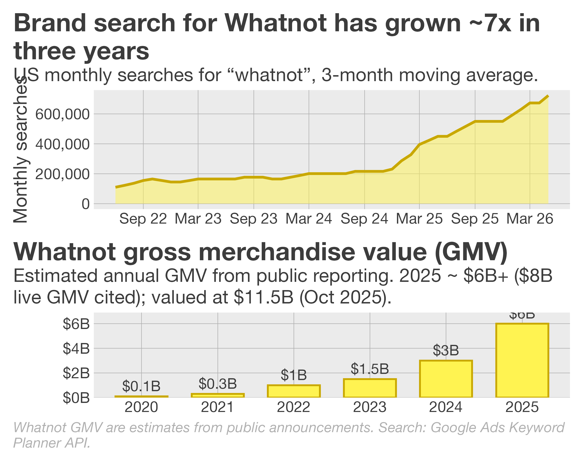
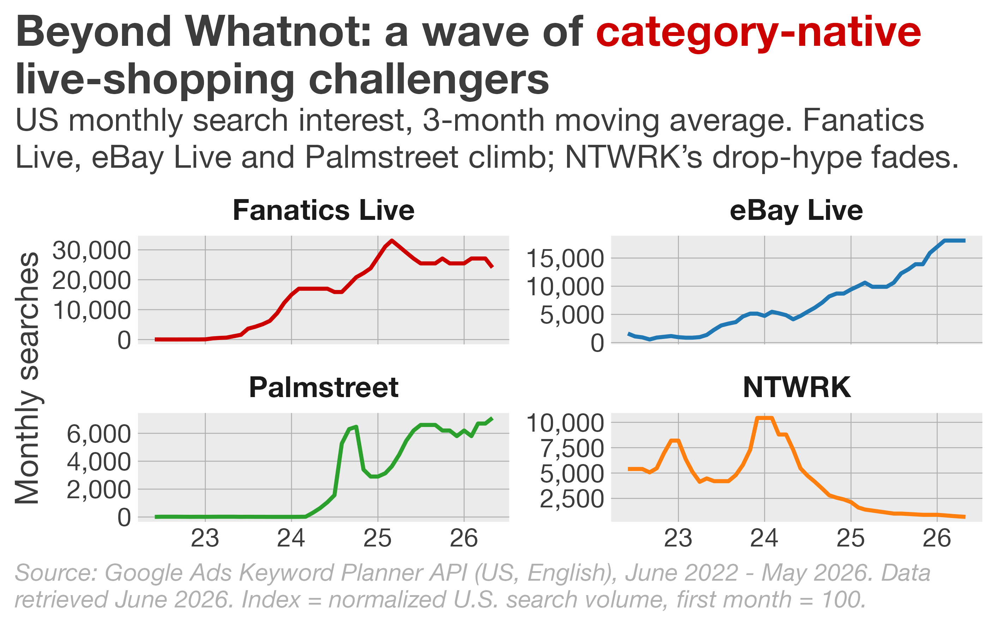
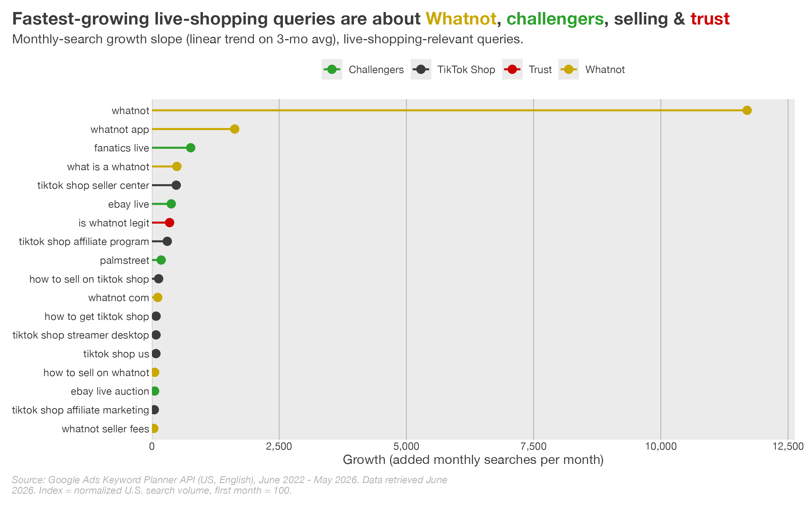
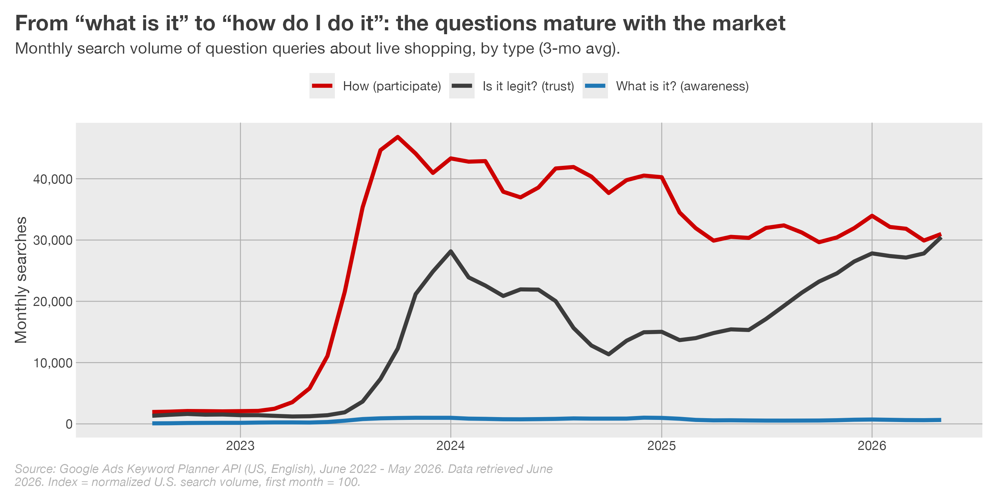
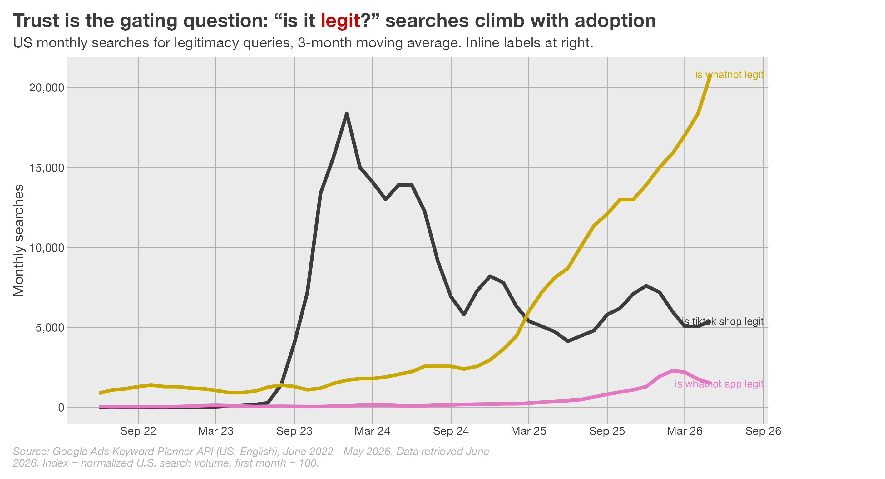
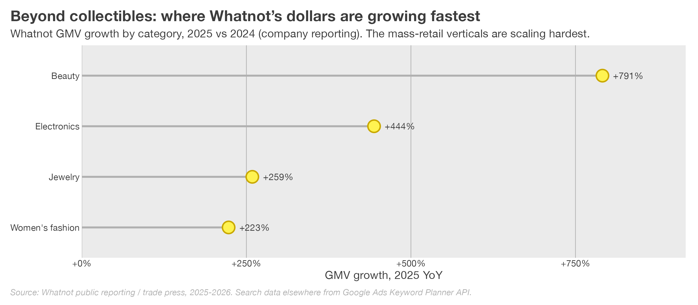

# Executive summary

- **The category broke out in 2025.** Average monthly US search interest across a basket of
  188+ live-shopping queries rose about **49% in 2025 versus 2024** (from roughly 5,840 to
  8,680 indexed monthly searches), after two years of post-Meta decline that bottomed in
  mid-2024.

- **The single biggest spike is event-driven.** The index hit its peak in **January 2025**
  (more than 2.2x the June-2022 baseline), coinciding with the US TikTok ban drama and brief
  outage. Interest did not collapse afterwards - it settled onto a structurally higher
  plateau through 2025 and into 2026.

- **Whatnot is the defining company of this cycle.** Brand search for "whatnot" has grown
  roughly **7x in three years**; it is by far the fastest-growing live-shopping query. Whatnot
  reported **~$6B+ GMV in 2025** (with ~$8B in live GMV cited) and raised **$225M at an
  $11.5B valuation** in October 2025 - double its value at the start of the year.

- **A wave of category-native challengers has arrived.** Search interest is climbing for
  **Fanatics Live**, **eBay Live**, and **Palmstreet**, while **StockX Live** launches in
  summer 2026. The hype-driven drops model (NTWRK) is fading.

- **The supply side runs hotter than the demand side.** The **live-selling** index has more
  than doubled since 2022 (index ~246), and seller-intent queries - "how to sell on Whatnot",
  "TikTok Shop seller center", "whatnot seller fees" - are among the fastest growers. Sellers
  are a leading indicator.

- **Trust is the gating question.** "Is it legit?" searches scale with adoption. TikTok Shop
  legitimacy fears spiked after its 2023 US launch and then eased; **"is whatnot legit"** has
  climbed steadily and now leads, a natural by-product of mainstream growth.

- **Collectibles still lead, but the mix is broadening.** Trading cards / breaks dominate
  live-shopping vertical search (+135% over the window), while Whatnot's own reporting shows
  beauty, electronics, jewelry and women's fashion as its fastest-growing GMV categories.



# Twelve things that surprised us

A quick-reference of the less-obvious findings in this report - the things industry insiders
may not already know:

1. The famous **January 2025 spike was mostly a flash** - only ~13% of the jump persisted.
2. ...but it left a **real ~18% lift** in the baseline. Distinguish the flash from the floor.
3. **Live-selling search leads live-shopping search by ~6 months** - a usable leading indicator.
4. **15,000+** QVC/HSN keywords surfaced organically - the "home shopping vs. live shopping"
   academic distinction has collapsed in practice.
5. QVC/HSN's **legacy terms decline while "official site"/app terms rise** - the audience is
   migrating screen-to-screen, not disappearing.
6. **NTWRK collapsed ~96%** from its peak - hype-driven drops are rented; community is owned.
7. **Palmstreet** (live plant/ceramics selling) broke out from near-zero in mid-2024 - the
   new-entrant pipeline is open.
8. The US wave is **home-grown**: interest in Chinese super-apps (Douyin, Taobao Live) is
   negligible as *shopping* intent.
9. **"How do I do it" now outranks "what is it" and "is it legit"** - the market has shifted
   from awareness to participation.
10. The category is **rotating, not consolidating** - the concentration index rose only mildly.
11. **Brand search is escaping the category vocabulary** - people search "whatnot," not
    "whatnot live shopping."
12. **Trading cards lead live-shopping vertical search, but beauty leads the GMV growth** (+791%
    on Whatnot) - the on-ramp and the money are different verticals.



# Introduction and method

Live shopping - real-time, video-led commerce where a host sells to a live audience that can
buy, bid, and chat in the moment - has been "about to happen" in the US for years. In China it
is mature (an estimated ~60% of e-commerce involves live formats); in the US it has hovered
around ~5% of e-commerce. The question for 2026 is whether the US has finally turned the
corner. Search behaviour is a useful, unbiased leading signal: it captures demand before it
shows up in GMV, and it captures supply-side intent (people learning to sell) before sellers
are onboarded.

## What we measure

We track **search interest** - how often Americans search Google for live-shopping-related
terms - as a proxy for category attention. Two indices are built:

- **Live Shopping index** - consumer-facing queries (e.g. *live shopping*, *tiktok live
  shopping*, *whatnot live shopping*, *live commerce*).
- **Live Selling index** - seller-oriented queries (e.g. *live selling*, *how to sell on
  whatnot*, *tiktok live selling*).

## How the data is built

Starting from ~7,700 curated seed terms covering established and emerging live-shopping
platforms and verticals, we expanded them via the Google Ads Keyword Planner API
into a universe of **~257,000 raw keyword ideas**, de-duplicated to **~79,000 unique keywords**
with complete monthly histories. The window is **June 2022 - May 2026 (48 months), US and
English only.** Each index sums monthly search volume across its keyword basket and is
normalized so the first month = 100. Charts show a 3-month moving average to suppress
month-to-month noise; the thin grey line is the raw monthly series.

A note on the data: every number here comes from **one fresh pull** with no spliced-in
historical volumes, so the series is internally consistent. Known bot-inflated terms are
excluded. This is a US-only report; international markets are out of scope by design.



# The headline: a trough, then a breakout

{#fig-index width=100%}

The shape of @fig-index is the story of the whole report. Three phases stand out:

1. **Drift and decline (2022 - mid-2024).** Meta's retreat from native live shopping -
   Facebook live shopping ended in 2022, Instagram's in early 2023 - removed the most visible
   on-ramp for mainstream US consumers. Interest drifted down and reached its **lowest point
   in mid-2024**.

2. **The inflection (late 2024 - early 2025).** Interest turned up sharply in Q4 2024 and
   **peaked in January 2025**, when the US TikTok ban saga and brief app-store outage put
   social commerce on every front page. This is the clearest example in the data of an
   external event moving the category.

3. **A higher plateau (2025 - 2026).** Crucially, interest did **not** revert to the 2024
   trough. It settled onto a visibly higher band, with seasonal peaks (holiday quarters) now
   towering over the old baseline. Average monthly interest in 2025 was about **49% above
   2024**.

The deeper point is the floor, not the ceiling: this reads as a **regime change** rather than a
temporary bounce - the baseline has moved up, not just the seasonal peaks.

# What drove the inflection

Search interest rarely moves on its own. Overlaying the index against the live-shopping news
cycle, a handful of events align with the turns in @fig-index:

| When | Event | Effect on search |
|------|-------|------------------|
| Aug 2022 / Mar 2023 | Meta ends Facebook / Instagram live shopping | Removes a mainstream on-ramp; interest drifts down |
| Sep 2023 | TikTok Shop launches in the US | Re-seeds the category; stabilizes interest |
| Jan 2025 | US TikTok ban drama + brief outage | Largest single spike on record |
| Feb 2025 | Qurate rebrands to QVC Group ("live social shopping company") | Legacy TV shopping repositions around live |
| Apr 2025 | QVC launches a 24/7 live channel on TikTok | Reinforces the TikTok-as-storefront narrative |
| Oct 2025 | Whatnot raises $225M at an $11.5B valuation | Validates the category for investors and press |
| Jan 2026 | TikTok US "USDS" joint venture closes (ban resolved) | Removes the existential overhang for the biggest social storefront |

The throughline is **TikTok**. Its 2023 launch re-seeded US live commerce; its 2025 political
drama supplied the demand shock; and the January 2026 ownership resolution (ByteDance below
20%, an Oracle / Silver Lake / MGX-led group holding the majority) removed the tail risk that
had hung over the single largest social storefront. TikTok Shop's own scale underlines why
this matters: **US GMV grew from ~$9B in 2024 to ~$15B in 2025**, and the number of US sellers
exploded from ~4,450 in mid-2023 to ~475,000 by mid-2025.

## The January 2025 spike as a natural experiment

The TikTok ban drama is, in effect, a natural experiment: a sudden, exogenous shock to
attention, after which we can measure what stuck. Decomposing the index around it is revealing,
and a little humbling for anyone tempted to read every spike as a step-change:

- **The spike was huge but mostly transient.** January 2025 reached an index of **228 - about
  2.4x** the trailing six-month average (Jul-Dec 2024 ≈ 97). That is a genuine attention shock.
- **Most of it washed out.** Averaging the post-spike plateau (Jun-Dec 2025 ≈ 114) against the
  pre-spike base shows the category **retained only ~13% of the jump.** The flashbulb faded.
- **But the residue is real.** That same plateau still sits **~18% above the pre-spike base** -
  a permanent lift, not a full reversion. And it arrived alongside the *structural* changes
  (QVC on TikTok, Whatnot's raise, new entrants) that the shock helped catalyse.

The lesson for reading this category: distinguish the **flash** from the **floor.** Event spikes
are mostly transient; the durable signal is the slow, unglamorous rise in the baseline - which
is exactly what the moving average in @fig-index isolates.



# When live shopping happens: seasonality

Beyond the long-run trend, the category has a distinct **annual rhythm** (@fig-seasonality).
Stripping out the level and averaging each calendar month across the window shows interest
concentrating in two periods: the **holiday quarter** (October-December, when gifting and
deal-hunting peak) and a secondary **late-winter/spring** bump.

{#fig-seasonality width=92%}

Two caveats make this more interesting than a simple "holidays are big" story. First, the
towering **January** average is largely an artefact of the one-off 2025 TikTok-ban spike rather
than a recurring seasonal feature - a good reminder that event shocks and seasonality can be
confounded. Second, the summer trough (June-September) is shallow and rising year on year,
which is consistent with the category becoming a **year-round habit** rather than a purely
gift-driven one. For sellers and platforms, the practical read is that the calendar still
rewards a Q4 push, but the off-season floor is where the structural growth is showing up.



# The supply side leads: live selling

{#fig-sell width=100%}

One of the most reliable patterns in the data is that **sellers move first**. The live-selling
index (@fig-sell) has more than doubled since 2022 and sits well above the consumer index in
relative terms. Seller-intent queries are also disproportionately represented among the
fastest-growing terms overall: *how to sell on whatnot*, *tiktok shop seller center*, *tiktok
shop affiliate program*, *whatnot seller fees*.

Why this matters: live commerce is a two-sided market, and supply is the constraint. A surge in
people learning **how to sell** is a leading indicator that the next wave of inventory,
hosts, and content is being created now - which tends to pull consumer interest up behind it.
The signal-to-noise on the selling side is also higher: nobody idly searches "whatnot seller
fees" - that is someone with a business plan.

A sample of the seller-learning vocabulary makes the point concrete. These are not high-volume
head terms; they are the quiet, high-intent queries of people deciding to become live sellers.

| Keyword | Avg. monthly searches | 4-yr trend |
|---|---:|---|
| tiktok shop seller center | 18,100 | up |
| how to sell on tiktok shop | 4,400 | up |
| how to sell on whatnot | 2,900 | up |
| whatnot seller fees | 1,600 | up |
| how to start a tiktok shop | 1,000 | flat |
| whatnot seller | 880 | flat |
| how to start selling on whatnot | 260 | flat |

: Sample of seller-intent queries. The full universe contains ~100 distinct "how to sell"-style live-shopping terms. {#tbl-sellers tbl-colwidths="[60,22,18]"}

## Sellers as a leading indicator - quantified

The claim that "sellers move first" is testable, not just intuitive. If we correlate the
month-over-month change in the live-selling index against the live-shopping index at a range of
time offsets (@fig-leadlag), the correlation peaks where **selling leads shopping by roughly
six months.** In other words, a surge in people learning to sell tends to show up about two
quarters *before* the corresponding rise in consumer-side interest.

{#fig-leadlag width=92%}

The relationship is moderate, not deterministic (the category is noisy and event-driven), but
the direction is consistent and intuitive: live commerce is supply-constrained, so the people
building the next wave of inventory and content move before the audience does. For anyone trying
to time the category - investors, platforms, brands - **the live-selling index is the more
useful leading dashboard**, even though it is smaller and quieter than the consumer index.

# Platform rotation

![Live-shopping search interest by platform (queries of the form "[platform] live shopping"), 3-month moving average. Whatnot and QVC/HSN trend up; Meta's surfaces fade; TikTok dominates and spikes with the 2025 news cycle.](figures/fig_platform.png){#fig-platform width=100%}

When we slice live-shopping queries by the platform named in them (@fig-platform), a clear
**rotation** appears:

- **TikTok** dominates in absolute terms and shows the January 2025 spike most violently - it
  is the lightning rod for category attention.
- **Whatnot** and **QVC/HSN** are the two clear up-and-to-the-right trends. QVC/HSN is the more
  surprising of the two: a 40-year-old TV-shopping incumbent is being **re-discovered through
  a live-social lens**, helped by its 2025 rebrand and its 24/7 TikTok channel.
- **Facebook and Instagram** fade steadily - the long tail of Meta's 2022-23 exit.
- **eBay** is volatile but present, buoyed by eBay Live's expansion into collectibles, watches,
  and handbags.

The strategic read: the category is **not** consolidating onto one app. TikTok is the
top-of-funnel attention engine, Whatnot is the category-native destination, and QVC/HSN shows
that incumbents can re-platform onto live-social rather than be displaced by it - even as the
parent company restructures (QVC Group filed a prepackaged Chapter 11 in April 2026 to cut
debt while pursuing its live-social "WIN" strategy).

## The rotation, in shares

Looking at *shares* rather than levels makes the rotation unmistakable (@fig-platform-share).
Among branded "[platform] live shopping" searches, **Whatnot climbed from roughly 1% to ~8%**
of the pie, and QVC/HSN gained, while Facebook and Instagram surrendered share they had held
since the pandemic.

![Share of branded '[platform] live shopping' search by month. Whatnot and QVC/HSN gain share; Meta's surfaces give it up.](figures/fig_platform_share.png){#fig-platform-share width=100%}

Two structural caveats make this more interesting than a simple horse race:

- **The category is mildly concentrating, not consolidating.** A Herfindahl index of branded
  live-shopping search rose only modestly (from ~1,770 to ~2,040 over the window) - still well
  below levels that would signal a single winner. The market is **rotating attention between
  many players**, not collapsing onto one. @fig-concentration shows the other side of that coin:
  Whatnot's own slice of branded live-shopping search climbed from a rounding error to a
  meaningful share over the window.
- **The brand energy is escaping the "live shopping" phrasing entirely.** Within explicit
  "live shopping" queries, the *branded* share actually fell (from ~40% to ~31%) as Meta's terms
  collapsed. But that understates the brands, because the real brand search has migrated to
  *standalone names* - people now simply search "**whatnot**", not "whatnot live shopping." When
  a platform becomes a verb, it leaves the category's generic vocabulary behind. That migration -
  from concept search to brand search - is itself a marker of the category maturing.

![Whatnot's share of all branded '[platform] live shopping' search over time (3-mo avg).](figures/fig_concentration.png){#fig-concentration width=92%}



# Home shopping's quiet reinvention: QVC and HSN

One of the most surprising findings is how **enormous the QVC/HSN footprint is** inside an
organically-grown live-shopping keyword set.
The seed universe was expanded using Google's own "related terms" suggestions, so the keywords
that surface are the ones Google associates with live shopping in practice. On that basis,
**more than 15,000** of our keywords relate to QVC or HSN - literally thousands of distinct
queries.

This matters because the academic literature has long drawn a line between *live shopping*
(social, creator-led, interactive) and *home shopping networks* (broadcast TV retail). Google's
association data quietly erases that line: in the market's mental model, QVC and HSN **are**
live shopping. That is the "academic conclusions vs. market reality" gap in one statistic.

| Keyword | Avg. monthly searches | 4-yr trend |
|---|---:|---|
| qvc | 3,350,000 | down |
| hsn | 1,000,000 | down |
| qvc com official site | 201,000 | up |
| qvc live | 40,500 | down |
| qvc tv live | 40,500 | down |
| hsn official site | 9,900 | up |
| qvc com official site shopping online | 12,100 | up |
| hsn app | 2,400 | flat |

: A small sample of the 15,000+ QVC/HSN-related queries in the universe. {#tbl-qvc tbl-colwidths="[58,24,18]"}

The trend split inside @tbl-qvc is the real story. The **legacy brand terms are declining**
(*qvc*, *hsn*, *qvc tv live*) - the old TV-shopping habit is fading - while **"official site",
"app" and "shopping online" variants are rising.** A 40-year-old audience is migrating from the
TV set to the website and the app, exactly as QVC Group's strategy intends.

The corporate moves line up with the search data:

- **Feb 2025:** Qurate Retail rebrands as **QVC Group**, explicitly to become a "live social
  shopping company."
- **Apr 2025:** QVC launches the first **24/7 live-shopping channel on TikTok** in the US.
- **Apr 2026:** QVC Group files a **prepackaged Chapter 11** to cut debt while pursuing its
  live-social "WIN" strategy.

The open question is whether a broadcast-era brand can convince a social-era audience. The
data says the transition is real and underway; whether it is *enough* - and whether it wins
genuinely new audiences rather than just retaining the old one online - is the thing to watch.
It is the clearest test in the market of whether incumbents can re-platform onto live-social
rather than be displaced by it.



# Whatnot: the defining company of the cycle

{#fig-whatnot width=92%}

If 2025 has a protagonist, it is **Whatnot**. By every angle in the data it is the strongest
trend in live shopping:

- **Search:** brand interest is up ~7x in three years (@fig-whatnot, top) and "whatnot" is the
  single fastest-growing live-shopping query by a wide margin.
- **GMV:** roughly **$0.1B (2020) -> $1.5B (2023) -> $3B (2024) -> $6B+ (2025)**, with the
  company citing ~$8B in live GMV and revenue approaching $1B. Growth has been close to 2x a
  year.
- **Capital:** a **$225M round at an $11.5B valuation** in October 2025 (DST Global and CapitalG
  leading; Sequoia, a16z, Greycroft, BOND participating), roughly double the start-of-year
  mark; ~$968M raised since 2019.
- **Engagement:** ~80-95 minutes per active user per day, >80% month-over-month retention, and
  new buyers up ~285% year on year. It ranked the **#1 shopping app in both the US and UK** in
  2025 and did **$100M+ in live sales on Black Friday alone**.

The open question for any company growing this fast is whether it can keep doubling. The 2025
data says yes: it both **doubled GMV and re-rated in the private markets**, while broadening
from its collectibles roots into 140+ categories. The risk is no longer demand - it is whether supply
(sellers, moderation, fulfillment, trust) can scale with it.

**So what is actually driving it?** The data cannot fully answer the "why", but it points at
the ingredients worth studying:

- **Community over catalogue.** Whatnot grew out of a passionate collectibles community
  (cards, Funko, sneakers) where the live format mirrors how those hobbies already work -
  drops, breaks, banter, and the thrill of the hunt. Engagement of ~80-95 minutes a day looks
  more like a social network than a store.
- **Niche-first, then broaden.** It owned a vertical before chasing everything, then used that
  trust and habit to expand into beauty, fashion and electronics - the categories now scaling
  fastest by GMV.
- **Format and trust infrastructure.** Native auctions, buyer protection, and seller tooling
  turn a chaotic livestream into a transactable marketplace. The fact that "*is whatnot legit*"
  is a top-growing query (see the *Trust* section) is, paradoxically, a sign the format has
  reached the skeptical mainstream.

The strategic lesson for the rest of the industry: live shopping in the US did not take off as
a generic "video + cart" feature bolted onto existing apps - it took off where a real
community already wanted to gather and trade.

# The challengers

{#fig-emerging width=100%}

Whatnot is not alone. A cohort of **category-native** platforms is gaining search traction
(@fig-emerging), each owning a vertical rather than chasing "everything live":

- **Fanatics Live** - trading cards and sports collectibles, leveraging Fanatics' licensing
  and "breaks" culture. The clearest challenger uptrend.
- **eBay Live** - cards and collectibles first, now luxury watches, handbags and fashion;
  expanding to Germany and Canada in 2026.
- **Palmstreet** - a genuine surprise: a niche live marketplace (plants, ceramics, niche
  collectibles) breaking out from near zero in 2024 to a durable base.
- **StockX Live** - announced for **summer 2026** (sneakers, apparel, cards, vintage); too new
  to register in search yet, but one to watch.
- **NTWRK** - the celebrity/drops model has **faded** from its 2023-24 peak, a reminder that
  hype-driven formats are harder to sustain than community-driven ones.

## When they arrived - and who survived

Dating each challenger's first month of meaningful search adds a time dimension to the story -
and a cautionary tale about churn:

| Platform | First meaningful search | Peak monthly | Latest | Status |
|---|---|---:|---:|---|
| Whatnot | Jun 2022 (already rising) | 823,000 | 823,000 | At/near peak |
| eBay Live | May 2023 | 18,100 | 18,100 | At/near peak |
| Fanatics Live | Jul 2023 | 33,100 | 18,100 | Off peak, durable |
| Palmstreet | Jun 2024 | 12,100 | 6,600 | Newest breakout |
| NTWRK | (early) | 14,800 | 590 | Collapsed (-96%) |
| StockX Live | not yet | - | - | Launches summer 2026 |

: Emergence and survival of live-shopping challengers. {#tbl-emergence tbl-colwidths="[24,30,16,14,16]"}

The standout in @tbl-emergence is **NTWRK's collapse - down roughly 96% from its peak.** The
celebrity-drops model burned bright in 2023-24 and then faded fast, a sharp contrast with the
community-driven platforms that have held or grown. It is the clearest evidence in the data for
the report's recurring thesis: **hype is rented, community is owned.** Palmstreet, emerging only
in mid-2024, shows the pipeline of new entrants is still very much open.

The pattern is telling: the winners are **community-and-category-native** (Whatnot, Fanatics,
Palmstreet), not generic "live video + cart" tools. Owning a passionate vertical beats owning a
feature.



# Platform profiles: a field guide

The US live-shopping landscape is best understood not as one market but as a **federation of
lanes**. The table below maps the main players by their model and primary vertical, with a
read on where each sits in the search data.

| Platform | Model | Primary vertical(s) | Search signal |
|---|---|---|---|
| TikTok Shop | Social feed + live | Beauty, fashion, gadgets | Dominant; spikes with news |
| Whatnot | Live marketplace + auctions | Collectibles, then beauty/fashion | Strongest grower (~7x) |
| QVC / HSN | Broadcast + streaming + social | Beauty, fashion, home, jewelry | Huge base; re-platforming |
| Fanatics Live | Live + card breaks | Sports cards, collectibles | Clear uptrend |
| eBay Live | Live auctions | Cards, watches, handbags, fashion | Rising, expanding geos |
| Amazon Live | Influencer streams + catalogue | Broad consumer goods | Steady, low LS-specific search |
| YouTube Shopping | Creator + shoppable video | Broad, creator-led | Emerging |
| StockX Live | Live drops + auctions | Sneakers, apparel, cards | Launches summer 2026 |
| NTWRK | Celebrity drops | Streetwear, sneakers, pop culture | Faded from 2023-24 peak |
| Palmstreet | Live marketplace | Plants, ceramics, niche collectibles | Breakout from ~zero |
| TalkShopLive | Host-driven shoppable shows | Books, celebrity, CPG | Niche, partnership-led |
| Popshop Live (CommentSold) | Live marketplace + SMB tooling | SMB retail, fashion | Consolidating |

: The US live-shopping field, by model and vertical. {#tbl-platforms tbl-colwidths="[20,26,30,24]"}

A few cross-cutting observations:

- **Two super-funnels, many destinations.** TikTok Shop and (to a lesser extent) YouTube and
  Instagram are where mainstream audiences *discover* live shopping; the category-native
  marketplaces (Whatnot, Fanatics, eBay Live, Palmstreet) are where committed buyers *transact*.
  The discovery layer and the destination layer are increasingly distinct businesses.

- **Collectibles is the on-ramp, everything else is the expansion.** Almost every successful
  destination - Whatnot, Fanatics Live, eBay Live, StockX Live - started in cards/sneakers/
  collectibles and is now broadening. The passion vertical builds the daily-active habit; the
  mass verticals (beauty, fashion, electronics) scale the dollars.

- **Incumbents are re-platforming, not dying.** QVC/HSN's enormous existing audience is being
  migrated onto streaming, social and a 24/7 TikTok channel. eBay is bolting live onto a
  marketplace with 30 years of supply. The incumbent advantage is inventory and trust; the
  challenger advantage is format-native engagement.

- **The toolkit layer is real but quieter.** Behind the destinations sits a B2B enablement
  layer (CommentSold, Bambuser-style providers, shoppable-video tools). In US *search*, the
  destination apps dominate - but roughly half of recent live-commerce funding has gone to this
  infrastructure layer, suggesting investors expect the plumbing to matter as much as the
  storefronts.



# What is growing fastest

{#fig-growers width=100%}

Ranking every live-shopping-relevant query by its growth slope (@fig-growers) is a compact
summary of the whole report. Four themes own the leaderboard:

1. **Whatnot** - the brand and its long tail (*whatnot app*, *what is a whatnot*, *whatnot
   com*, *whatnot seller fees*).
2. **Challengers** - *fanatics live*, *ebay live*, *palmstreet*, *ebay live auction*.
3. **Selling** - *tiktok shop seller center*, *how to sell on tiktok shop*, *tiktok shop
   affiliate program*, *how to sell on whatnot*.
4. **Trust** - *is whatnot legit*, *is whatnot app legit*.

That trust queries grow alongside brand and seller queries is the single most interesting
cross-cutting finding, and it deserves its own section (see *Trust*, below).



# Micro-trends: spotlights from the long tail

The headline indices summarize the category, but the most interesting material is often in the
*texture* of the queries - the specific things people type. Below are several themes that
surfaced while mining the ~79,000-keyword universe. Some are trending hard, some are flat;
all of them are revealing about how Americans actually think about live shopping. (A guiding
principle: don't dismiss low monthly volumes - roughly 95% of all search terms get fewer than
10 searches a month, and that long tail is exactly where a trend hides before it is obvious to
everyone else.)

## What people ask

The question queries are a window into the category's psychology. The two largest -
"*what is a whatnot*" and "*is whatnot legit*" - capture the whole arc of a platform going
mainstream: first people learn what it is, then they ask whether they can trust it.

| Keyword | Avg. monthly searches | 4-yr trend |
|---|---:|---|
| what is a whatnot | 22,200 | up |
| is whatnot legit | 14,800 | up |
| is tiktok shop legit | 5,400 | up |
| what is qvc | 4,400 | flat |
| how does tiktok shop work | 1,000 | flat |
| is whatnot app legit | 1,300 | up |

: Sample of question queries (399 in the universe). {#tbl-questions tbl-colwidths="[58,24,18]"}

## Shoppers and sellers compare platforms

Comparison queries are small in volume but disproportionately informative - they show which
two options are genuinely in a shopper's consideration set. In live shopping, the comparison
that matters is overwhelmingly **Whatnot vs. eBay** - the collectibles incumbent against the
live-native challenger.

| Keyword | Avg. monthly searches | 4-yr trend |
|---|---:|---|
| whatnot vs ebay | 390 | flat |
| ebay vs whatnot | 90 | flat |
| qvc alternative shopping | 10 | flat |

: Comparison queries. {#tbl-compare tbl-colwidths="[58,24,18]"}

## Tools, apps and "how do I go live"

A steady cluster of generic tooling queries - *live shopping platform*, *livestream shopping
app* - shows demand from brands and sellers looking for the infrastructure to broadcast,
distinct from any single destination app. Whatnot's own app query dwarfs them, a reminder that
in the US the destination is winning over the toolkit.

| Keyword | Avg. monthly searches | 4-yr trend |
|---|---:|---|
| whatnot app | 90,500 | up |
| hsn app | 2,400 | flat |
| live shopping platform | 1,900 | up |
| livestream shopping app | 1,300 | flat |
| live stream shopping platform | 1,300 | flat |

: Tools / apps / platform queries (245 in the universe). {#tbl-tools tbl-colwidths="[58,24,18]"}

## Trading cards and "breaks": the collectibles engine, in miniature

The collectibles vocabulary is highly fragmented - hundreds of specific, low-volume terms
rather than a few big ones. That fragmentation is itself the signal: this is a deep, active
community with its own language ("breaks", "rips", specific sets), not a casual audience.

| Keyword | Avg. monthly searches | 4-yr trend |
|---|---:|---|
| whatnot card | 480 | flat |
| whatnot sports cards | 390 | flat |
| live sports card breaks | 320 | flat |
| card breaks live | 320 | flat |

: Sample of live card-breaking queries. {#tbl-cards tbl-colwidths="[58,24,18]"}

## Niche breakouts: plants and thrift go live

Two genuinely new niches show up. **Palmstreet** - live selling of plants, ceramics and niche
collectibles - has broken out from near zero, and **"live thrifting"** is emerging as a
behaviour in its own right. These are the kind of small, weird, fast-growing signals that tend
to precede the next mainstream vertical.

| Keyword | Avg. monthly searches | 4-yr trend |
|---|---:|---|
| palmstreet | 6,600 | up |
| palmstreet app | 1,000 | up |
| live thrifting | 210 | flat |

: Sample of niche-format queries. {#tbl-niche tbl-colwidths="[58,24,18]"}

## The wave is home-grown, not imported

A useful negative finding: despite China's mature live-commerce market, **US interest in
foreign live-shopping platforms is faint.** The Chinese super-apps that dominate live commerce
abroad (Douyin, Kuaishou, Taobao Live, Shopee) appear in US search almost entirely as
*app-download* curiosity rather than shopping intent, and genuine cross-border live-shopping
terms are tiny.

| Keyword | Avg. monthly searches | 4-yr trend |
|---|---:|---|
| douyin | 90,500 | up |
| kuaishou | 5,400 | up |
| live shopee | 320 | flat |
| taobao live shopping | 10 | flat |

: US search for international live-commerce apps - mostly download curiosity, not shopping. {#tbl-intl tbl-colwidths="[58,24,18]"}

The implication is strategically important: the US live-shopping breakout is **domestically
driven** - by TikTok Shop, Whatnot and the collectibles community - not a spillover from Asian
platforms. The American market is building its own version rather than importing one.

## Whatnot's long tail

Finally, the depth of Whatnot's brand footprint is itself a signal. Beyond the head term, a
long tail of intent-rich queries has formed - fees, selling, the company, the website - the
kind of vocabulary that only accretes around a platform people are seriously using and
seriously considering selling on.

| Keyword | Avg. monthly searches | 4-yr trend |
|---|---:|---|
| whatnot app | 90,500 | up |
| what is a whatnot | 22,200 | up |
| whatnot com | 6,600 | up |
| whatnot auction | 2,900 | flat |
| whatnot fees | 1,900 | up |
| whatnot shop | 1,900 | up |
| whatnot seller fees | 1,600 | up |

: A slice of Whatnot's 125-term brand long tail. {#tbl-wn-tail tbl-colwidths="[58,24,18]"}

# How the questions mature

There is a natural life-cycle to how people search a new category: first *what is it?*, then
*is it safe?*, then *how do I do it?* Bucketing live-shopping question queries by type and
tracking them over time (@fig-questions) shows the US market moving decisively into the third
phase.

{#fig-questions width=100%}

**"How" questions now dominate** - averaging nearly 28,000 searches a month versus ~15,000 for
trust questions and ~9,000 for "what is it" awareness. This is the signature of a maturing
market: the centre of gravity has shifted from *understanding* live shopping to *participating*
in it - how to sell, how to use the apps, how to get started. The awareness phase is largely
over. The two phases that remain live - participation ("how") and trust ("is it legit") - are
the two that platforms can most directly influence, and they are the subject of the next two
sections.

# Trust: "is it legit?" {#sec-trust}

{#fig-trust width=100%}

As live shopping goes mainstream, consumers do something very human: they ask whether they can
trust it. @fig-trust tracks legitimacy queries:

- **"Is TikTok Shop legit"** spiked dramatically after the 2023 US launch - a wave of
  skepticism about a new, unfamiliar, algorithm-driven storefront - then eased as the format
  became familiar.
- **"Is Whatnot legit"** has climbed steadily and now **leads**, which is exactly what you
  would expect from a platform moving from niche to mainstream: more new buyers means more
  first-time due-diligence searches.

The qualitative concerns behind these searches are consistent across platforms: counterfeit or
low-quality goods, items that never arrive (often small international sellers), and refund
friction. The practical implication for platforms is that **trust infrastructure - verified
sellers, buyer protection, transparent fees, dispute resolution - is now a growth lever, not a
compliance cost.** Trust questions are not a sign of trouble; they are a sign of scale. But
the platform that answers them best will convert the most skeptics.

# Vertical breakouts

Two complementary views of "what sells live" emerge from the data.

**On the search side, collectibles still lead.** Within a live-shopping context, **trading
cards and "breaks"** dominate vertical search interest and grew ~135% over the window - the
single clearest vertical signal. This is the cultural engine that built Whatnot, Fanatics Live
and eBay Live, and it remains the gateway drug into live shopping.

**On the GMV side, the mix is broadening fast.** Whatnot's own 2025 reporting shows its
fastest-growing categories by GMV are now well beyond collectibles:

| Category | Whatnot GMV growth (2025, YoY) |
|----------|-------------------------------|
| Beauty | +791% |
| Electronics | +444% |
| Jewelry | +259% |
| Women's fashion | +223% |

{#fig-gmv width=92%}

The reconciliation between the two views is the insight: **collectibles are the top of the
funnel** (they bring passionate, daily-active users in), while **beauty, fashion, electronics
and jewelry are where the dollars are scaling**. A platform that converts a card collector into
a beauty or fashion buyer captures both the engagement and the basket.

A closer look at the individual verticals:

- **Trading cards & sports memorabilia.** The original engine. The vocabulary is deep and
  fragmented (*breaks*, *rips*, set-specific terms), signalling a committed community rather
  than a casual audience. This is where Fanatics Live and eBay Live concentrate, and where
  Whatnot built its habit. Steady rather than explosive in search - because it is already
  mature within live shopping.

- **Beauty.** The fastest-growing GMV vertical on Whatnot (+791%) and a natural fit for live
  demonstration (swatches, tutorials, before/after). Notably, beauty also shows up heavily in
  **QVC/HSN** search (*qvc makeup*, *qvc skincare*) - the legacy networks' historical strength,
  now being carried into live-social. Beauty is the clearest example of live shopping crossing
  from hobbyist niche to mass retail.

- **Women's fashion & apparel.** Whatnot's fastest-growing *segment*, with individual sellers
  reportedly crossing $1M/month via clothing hauls and liquidation streams. Apparel suits the
  format's impulse-and-scarcity dynamics (limited sizes, "going once"), and resale/thrift gives
  it a sustainability angle that resonates with younger buyers.

- **Electronics & gadgets.** +444% GMV on Whatnot and a staple of TikTok Shop's deal-driven
  feed. Lower emotional engagement than collectibles, but high basket sizes and strong
  promotional response.

- **Jewelry & watches.** +259% GMV on Whatnot; eBay Live's expansion into luxury watches and
  handbags targets exactly this. High average order values make even modest volumes lucrative.

- **Plants, ceramics & "weird niches."** The frontier. Palmstreet's breakout shows that almost
  any passionate collecting community can support a live marketplace - the model generalizes
  wherever there is a hobby, a community, and items worth showing in real time.

# Live auctions: a parallel format

A distinct but related behaviour runs underneath the headline trend: **live auctions**.
Bid-based, time-pressured, collectibles-led selling (cards, sneakers, coins, comics, Funko)
shows up in queries like *ebay live auction* and underpins much of Whatnot's and Fanatics
Live's engagement. Auctions carry a different psychology from fixed-price live shopping - higher
intensity, social competition, and a "win" payoff - and they map onto the same collectibles
verticals that lead the category. StockX Live's 2026 entry is explicitly auction-and-drop
flavoured. Auctions are worth tracking as a leading indicator: they tend to attract the most
engaged users first.

| Keyword | Avg. monthly searches | 4-yr trend |
|---|---:|---|
| live auction | 40,500 | down |
| ebay live auction | 2,900 | up |
| live auction sites | 2,400 | up |
| live auction app | 720 | flat |
| whatnot live auction | 390 | flat |
| live bidding | 260 | flat |

: Sample of live-auction queries (334 in the universe). Note that some "live auction" terms also refer to offline auctions. {#tbl-auction tbl-colwidths="[58,24,18]"}

The split mirrors the platform story: the generic, partly-offline "*live auction*" term drifts
down, while the **platform-attached** auction terms (*ebay live auction*, *whatnot live
auction*) and the app/sites queries rise. Auctions are not fading; they are **moving onto
live-commerce platforms.**

# The long tail: where tomorrow's trends hide

A recurring theme of this research is that the interesting signal is rarely in the head terms.
Roughly **95% of all search queries** (across every topic, not just this one) get fewer than
ten searches a month. In an emerging category, that long tail is not noise to be discarded -
it is the leading edge, the place where a behaviour is visible before it has a name.

The table below mixes mid-volume and very-low-volume live-shopping terms to make the point. A
term like *taobao live shopping* (10/month) is a faint echo of the mature Chinese market; *live
thrifting* and *whatnot live auction* are small today but describe behaviours that could be
large tomorrow.

| Keyword | Avg. monthly searches | 4-yr trend |
|---|---:|---|
| whatnot auction | 2,900 | flat |
| palmstreet app | 1,000 | up |
| live sports card breaks | 320 | flat |
| how to start selling on whatnot | 260 | flat |
| live thrifting | 210 | flat |
| whatnot live auction | 390 | flat |
| taobao live shopping | 10 | flat |

: A walk down the long tail. {#tbl-longtail tbl-colwidths="[58,24,18]"}

The practical implication: anyone trying to ride this category - a brand, a platform, a host -
should be watching the sub-100-searches-a-month terms, because by the time a query is large,
the opportunity to be early is gone.

# Where the opportunities are

The search data does not just describe the market; it hints at gaps. A few opportunities that
fall out of the patterns above (offered as prompts, not predictions):

- **Multi-platform "go live once" tooling.** Sellers increasingly search across Whatnot,
  TikTok Shop, eBay Live and others. Tooling that lets a host broadcast to several platforms at
  once while keeping chat and cart unified addresses a real, visible pain.
- **A "live selling starter kit."** The surge in *how to sell* / *seller fees* queries reveals
  a wave of aspiring sellers who lack training and basic gear. Education plus a simple equipment
  bundle is a natural product.
- **Brand-to-platform (and brand-to-host) matching.** With the platform landscape fragmenting
  into category-native lanes, brands need help picking the right platform and the right host for
  their vertical - a curation/matchmaking opportunity.
- **Trust as a product.** Because "is it legit?" scales with adoption, verification,
  buyer-protection and transparent-fee features are not just compliance - they are a
  differentiator a platform or third party can build around.



# Beyond search: corroborating signals and global context

Search interest is one lens; it is more convincing when other signals point the same way.

**Other attention signals agree.** Whatnot's rise is mirrored in YouTube search, Reddit
activity, and Wikipedia pageviews - all "up and to the right." The same holds for the category
broadly: live-shopping subreddits have grown, creator content
explaining "how to sell on TikTok Shop / Whatnot" has proliferated, and the trade press now
covers the space as a category rather than a curiosity. When independent attention signals move
together, the underlying shift is more likely real than an artefact of one data source.

**Business metrics agree.** The search inflection is matched by hard numbers: Whatnot's GMV
roughly doubling to $6B+, TikTok Shop's US GMV rising to ~$15B, eBay Live's geographic
expansion, StockX's decision to build a live product, and QVC Group's strategic (if financially
strained) pivot. Search led; the dollars followed.

**Global context: the ceiling is high.** In China, live commerce is estimated to account for
roughly **60% of e-commerce**; in the US, the figure is around **5%**. Whether or not the US
ever approaches Chinese penetration, the gap frames the opportunity: even a partial convergence
implies years of structural growth. The US is also taking a recognisably different path -
community-and-collectibles-led, and domestically built - rather than copying the
Chinese super-app model wholesale.

# Risks: what could derail the breakout

The base case is constructive, but a credible report names the ways it could be wrong.

- **Trust erosion at scale.** The biggest risk is the flip side of the biggest opportunity. If
  counterfeits, non-delivery, and refund friction grow faster than verification and buyer
  protection, the "is it legit?" question could curdle from healthy curiosity into mainstream
  distrust - the one thing that reliably kills a nascent consumer behaviour.

- **TikTok execution risk.** The ownership question is resolved, but the new US joint venture
  still has to run a complex marketplace, keep creators and sellers engaged, and grow the
  *live* share of GMV (still only ~14%). Missteps at the largest discovery funnel would slow the
  whole category.

- **Seller economics and churn.** The supply surge is real, but live selling is hard work with
  thin margins for many. If aspiring sellers churn out faster than they are recruited - or if
  fee changes sour sentiment (note the rising *seller fees* queries) - the supply engine could
  stall.

- **Concentration risk.** Whatnot's dominance is a strength and a fragility: a single platform
  carrying so much of the category's momentum means its stumbles would be the category's
  stumbles.

- **Macro and attention competition.** Live shopping competes for discretionary spend and, just
  as critically, for attention. A consumer pullback or a shift in where people spend their
  screen time would pressure a format that depends on both.



# What it means - by stakeholder

The same data reads differently depending on where you sit. A consolidated view:

## For platforms and marketplaces

- **Win a community before a category.** Every durable destination started by owning a
  passionate vertical, then expanded. Generic "live video + cart" has repeatedly failed;
  community-native formats have repeatedly won.
- **Treat trust as a product, not a policy.** "Is it legit?" scales with adoption; the platform
  that most visibly solves verification, buyer protection and dispute resolution converts the
  most skeptics into buyers.

## For incumbent retailers and brands

- **Re-platform; don't wait to be displaced.** QVC/HSN's migration onto streaming, social and a
  24/7 TikTok channel shows incumbents can convert legacy audiences - the rising "official
  site"/app search proves the audience is willing to move.
- **Match the platform to the vertical.** The landscape is a federation of lanes (cards to
  Fanatics/eBay, beauty/fashion to TikTok Shop and Whatnot, drops to NTWRK's successors).
  There is no single "live shopping channel" to plug into.
- **The mass verticals are the prize.** Beauty, electronics, jewelry and fashion are scaling
  fastest by GMV - the dollars have moved well beyond the collectibles roots.

## For sellers and creators

- **You are early.** The seller ecosystem is forming now. The surge in "how to sell" queries is
  your competition arriving - but the audience is arriving faster.
- **Mind the economics.** Rising "seller fees" searches signal that take-rates and margins are
  front of mind. Platform choice is increasingly an economic decision, not just an audience one.

## For investors and analysts

- **Watch the live-selling index as the leading dashboard** - it leads consumer interest by
  roughly two quarters.
- **Distinguish the flash from the floor.** Event spikes (the TikTok ban) mostly revert; the
  durable signal is the rising baseline.

# What search data can - and cannot - tell you

In the spirit of intellectual honesty, it is worth being explicit about the method's limits.

**What it does well.** Search is an unbiased, real-time, behavioural signal. Nobody searches to
please a pollster. It captures *latent demand* (people considering live shopping before they
buy), *supply intent* (people learning to sell before they are onboarded), and *trust friction*
(people checking legitimacy before they commit) - often months before any of these show up in
GMV. Because it is continuous and granular, it surfaces micro-trends (Palmstreet, "live
thrifting") while they are still tiny.

**What it cannot do.** Search interest is attention, not transactions: a query is not a sale,
and the relationship between the two varies by category. Keyword Planner volumes are *bucketed*
(reported in bands), so absolute numbers are best read as orders of magnitude. Brand search and
category search can diverge - as Whatnot shows - so any single basket undercounts the
platforms that have become verbs. And search cannot explain *why*: it can show that "is whatnot
legit" is rising, but not what specifically reassures or alarms a shopper. The right posture is
to treat search as a **leading, directional indicator** to be triangulated against GMV,
funding, app rankings and qualitative research - which is exactly how this report uses it.



# Outlook and implications

**The base case for 2026-27 is continued, structurally higher growth.** The category cleared
three overhangs at once: Meta's exit is fully digested, TikTok's ownership question is resolved,
and a category-native champion (Whatnot) has both the GMV trajectory and the capital to keep
expanding. Search interest sits on a higher plateau, the supply side is heating up faster than
the demand side, and incumbents (QVC/HSN) are re-platforming rather than disappearing.

What to watch:

- **Can supply scale with trust intact?** The gating risk is no longer demand - it is whether
  platforms can grow sellers and inventory without letting counterfeits, non-delivery and
  refund friction erode the trust that adoption depends on.
- **Does the vertical mix keep broadening?** If beauty, fashion and electronics keep
  compounding the way collectibles did, live shopping graduates from a hobbyist niche to a
  mainstream retail channel.
- **TikTok Shop's live mix.** Livestreams are still a minority of TikTok Shop GMV (~14% in 2025
  vs ~10% in 2024); if that share climbs now that the ownership question is settled, it would
  meaningfully lift the whole category.
- **The challengers' lanes.** Fanatics Live, eBay Live, Palmstreet and the incoming StockX Live
  suggest the future is a **federation of category-native live marketplaces**, not a single
  winner-take-all app.

The one-line takeaway: **US live shopping in 2026 is no longer a question of "if" - it is a
question of how fast supply and trust can scale to meet demand that has already inflected.**

# A watchlist for 2026-27

If this report were a dashboard, these are the dials worth checking each quarter - chosen
because each one is an early, decision-relevant signal rather than a lagging headline:

| Signal | Why it matters | What would change the story |
|---|---|---|
| Live-selling index | Leads consumer interest by ~2 quarters | A sustained roll-over would warn of a slowdown before GMV shows it |
| TikTok Shop live-GMV share | Live is still only ~14% of its GMV | A rising live share would lift the whole category |
| StockX Live launch (summer 2026) | A credible, capitalised new entrant | Fast search traction would validate the auction-and-drops model |
| New-entrant pipeline | Palmstreet showed the lane is open | The next near-zero breakout is the next Palmstreet |
| "Is it legit?" trajectory | Trust gates mainstream adoption | A sharp acceleration would flag a trust problem at scale |
| Seller-fee / seller-economics queries | Supply is the constraint | Rising discontent would threaten the supply engine |
| QVC Group post-restructuring | Test of incumbent re-platforming | Success or failure here generalises to all legacy retail |

: A quarterly watchlist of leading signals. {#tbl-watchlist tbl-colwidths="[26,38,36]"}

Taken together, these dials describe a category that has cleared its existential questions and
now turns on execution: **scaling supply and trust.** The demand has already inflected;
2026-27 will be decided by how well the industry meets it.



# Appendix

## Methodology details

- **Source:** Google Ads Keyword Planner API (keyword ideas + historical metrics), US
  (location 2840), English (language 1000).
- **Window:** June 2022 - May 2026 (48 months), retrieved June 2026. The Keyword Planner
  returns a rolling 48-month window; the analysis uses only that fresh window and splices in no
  older data.
- **Seeds -> universe:** ~7,700 curated seeds (covering established and emerging platforms and
  verticals) expanded to ~257,000 raw ideas, de-duplicated (including metric-identical keyword
  collisions) to ~79,000 unique keywords with complete 48-month histories.
- **Indices:** the Live Shopping basket matches *live shop*, *livestream shop*, *live commerce*,
  *live stream shop*, *livestream commerce*; the Live Selling basket matches *live sell*.
  Monthly volumes are summed across the basket and normalized so the first month = 100. Charts
  use a right-aligned 3-month moving average.
- **Trend stats:** per-keyword 3-month rolling average and an OLS linear trend (slope, R-squared)
  on keywords with a meaningful signal (max monthly volume > 20, fewer than 47 zero months).
- **Exclusions:** known bot-inflated terms are removed; international markets are out of scope.
- **Theme tables:** keyword samples in the micro-trend tables are drawn from the cleaned
  universe by topic pattern and shown with average monthly searches and a "4-yr trend" label
  derived from the linear-trend slope (up / flat / down). Samples are curated for relevance and
  are illustrative, not exhaustive; volumes are Keyword Planner buckets.

## The data funnel

The universe was built in stages, each one narrowing toward signal:

| Stage | Count | What it is |
|---|---:|---|
| Curated seeds | ~7,700 | Seeds covering established and emerging platforms and verticals |
| Raw keyword ideas | ~257,000 | Google's keyword-ideas expansion of those seeds |
| Unique keywords (cleaned) | ~79,000 | After de-duplication, including metric-identical collisions |
| Modelable keywords | ~57,000 | After dropping near-zero / sparse series |
| Live-shopping basket | ~196 | Index constituents matching the live-shopping pattern |
| Live-selling basket | ~107 | Index constituents matching the live-selling pattern |

: The seed-to-index funnel. {#tbl-funnel tbl-colwidths="[46,18,36]"}

## The index basket

The live-shopping index is built from queries that explicitly express live-shopping intent.
They fall into five broad groups (with representative examples):

- **Definitions & concepts** - *live shopping*, *livestream shopping*, *live commerce*, *what is
  live shopping*.
- **Social platforms** - *tiktok live shopping*, *instagram live shopping*, *youtube live
  shopping*, *facebook live shopping*.
- **How-to & tools** - *live shopping app*, *live shopping platform*, *live stream shopping
  platform*.
- **Retailers & marketplaces** - *whatnot live shopping*, *amazon live shopping*, *qvc live
  shopping*, *hsn live shopping*, *ebay live shopping*.
- **Software providers** - vendor-named live-shopping tooling (e.g. *bambuser live shopping*).

Standalone brand terms (e.g. "whatnot" on its own) sit *outside* this intent basket by design,
which is why brand-level analyses in this report are run separately from the index.

## Glossary

- **Live shopping / live commerce** - real-time, video-led selling where a host presents
  products to a live audience that can buy, bid, and chat in the moment.
- **Live selling** - the seller-side of the same activity; the act of hosting and selling on a
  live stream.
- **GMV (gross merchandise value)** - the total value of goods sold through a platform; the
  standard scale metric for marketplaces.
- **Break / card break** - a live event where a host opens sealed trading-card product and
  distributes cards to buyers who purchased slots; a core collectibles format.
- **Drop** - a scheduled release of limited-quantity items, often with scarcity and hype
  (streetwear, sneakers, collectibles).
- **Search-interest index** - here, normalized total monthly Google search volume across a
  curated basket of queries, set to 100 in the first month of the window.
- **Slope (trend)** - the average monthly change in a keyword's smoothed search volume, used to
  rank growth.
- **Head term / long tail** - high-volume general queries (head) versus the vast number of
  low-volume specific queries (long tail), where early signals often appear first.

## Caveats

Search interest is a proxy for attention, not a direct measure of sales. Absolute Keyword
Planner volumes are bucketed and should be read as orders of magnitude. GMV, funding and event
figures are drawn from public reporting and company statements (see sources) and are estimates.

## Selected sources

- **Whatnot** (GMV, valuation, categories, engagement): Business of Fashion; Digital Commerce
  360; TechFunding News; Sacra; Fortune; Marketplace Pulse; FashionNetwork; Whatnot 2026 trends.
- **TikTok Shop** (US GMV, sellers, live mix): Momentum Works / The Low Down; FastMoss;
  Statista; Marketing LTB.
- **TikTok ownership deal** (Jan 2026 USDS joint venture): TechCrunch; Marketplace; Retail
  TouchPoints.
- **QVC Group** (rebrand, TikTok channel, Chapter 11): QVC Group SEC 8-K filings (CIK 1355096).
- **Challengers** (StockX Live, Fanatics Live, eBay Live, Popshop/CommentSold): PR Newswire;
  WWD; CNBC; Value Added Resource; Retail Dive.
- **Market size / adoption / trust**: GetStream; Grand View Research; Statista; eMarketer;
  consumer-trust coverage (Surfshark, TrustDALE, Avast, University of Kentucky ITS).

*Reproducible code and data pipeline: project repository (`pipeline-2026/`, `report-2026/`).*
